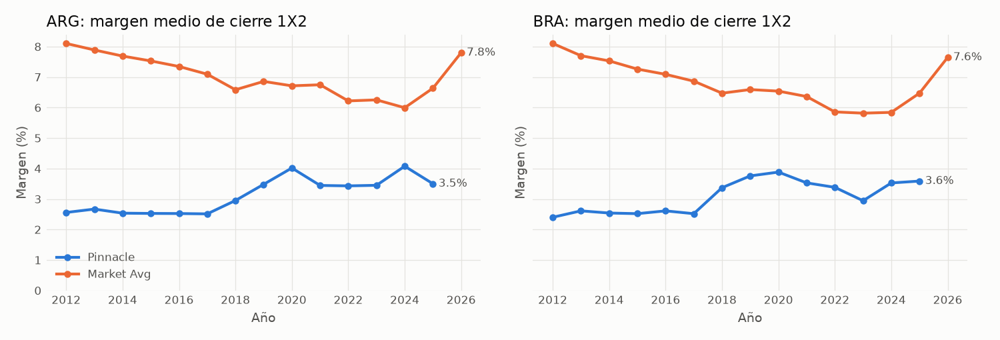
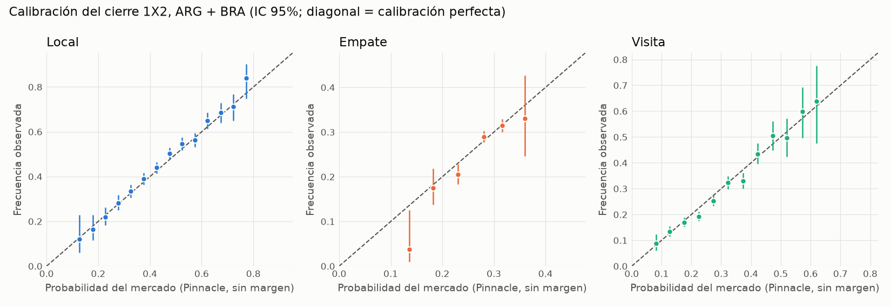
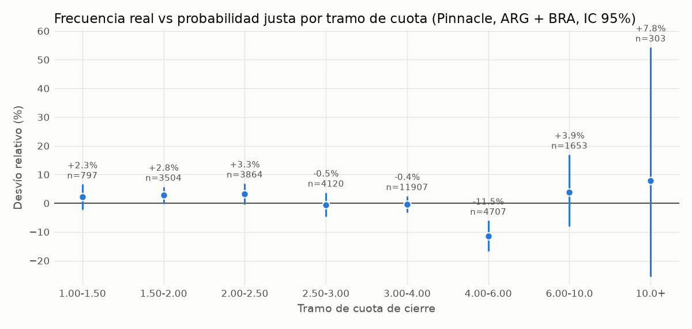

# Análisis 01 — Mercado de cierre 1X2 en Argentina y Brasil

*Generado por `scripts/analyze_market.py`. Datos: football-data.co.uk (cuotas de cierre).*

> **Exploratorio.** Usa todo el histórico, por lo que ningún patrón de aquí es una estrategia:
> cualquier regla de apuesta debe validarse fuera de muestra con walk-forward.

## 1. Cobertura

| Liga   |   Partidos | Desde      | Hasta      | Pinnacle   | Market Avg   | Market Max   | Bet365   | Betfair Exchange   |
|:-------|-----------:|:-----------|:-----------|:-----------|:-------------|:-------------|:---------|:-------------------|
| ARG    |       5479 | 2012-08-03 | 2026-10-06 | 91%        | 100%         | 100%         | 11%      | 22%                |
| BRA    |       5598 | 2012-05-19 | 2026-10-03 | 94%        | 100%         | 100%         | 9%       | 15%                |

Pinnacle deja de aparecer a fines de 2025 (cierre de su API pública). Desde 2026 la referencia
"sharp" disponible es Betfair Exchange; "Market Avg" existe en todo el período.

## 2. Margen de las casas

| Liga   | Casa             |   Partidos | Margen medio   | Mediana   |
|:-------|:-----------------|-----------:|:---------------|:----------|
| ARG    | Pinnacle         |       5010 | 3.06%          | 3.07%     |
| ARG    | Betfair Exchange |       1191 | 0.80%          | 0.75%     |
| ARG    | Market Avg       |       5479 | 7.02%          | 7.05%     |
| ARG    | Bet365           |        613 | 7.06%          | 7.07%     |
| BRA    | Pinnacle         |       5275 | 3.07%          | 3.04%     |
| BRA    | Betfair Exchange |        864 | 0.61%          | 0.60%     |
| BRA    | Market Avg       |       5598 | 6.79%          | 6.75%     |
| BRA    | Bet365           |        481 | 6.60%          | 6.55%     |

Betfair Exchange no incluye la comisión del exchange (2-5% sobre ganancias netas):
su margen efectivo es mayor que el mostrado.

**Implicancia:** para ganar apostando al promedio del mercado, el modelo debe superar un margen
de este orden. Contra Pinnacle el margen es menor, pero Pinnacle es también el precio más eficiente.

## 3. ¿Qué tan bueno es el mercado? (la vara a superar)

Mismos partidos (con cuota Pinnacle). Baseline naive = frecuencias H/D/A de la liga con partidos
anteriores a cada fecha (sin leakage).

| Liga   | Modelo                         |    n |   log_loss |    rps |   brier |   accuracy |
|:-------|:-------------------------------|-----:|-----------:|-------:|--------:|-----------:|
| ARG    | Frecuencias históricas (naive) | 5010 |     1.0752 | 0.2199 |  0.6505 |     0.4363 |
| ARG    | Pinnacle cierre (proportional) | 5010 |     1.0345 | 0.2066 |  0.6223 |     0.4661 |
| ARG    | Pinnacle cierre (power)        | 5010 |     1.0344 | 0.2066 |  0.6222 |     0.4661 |
| ARG    | Pinnacle cierre (shin)         | 5010 |     1.0345 | 0.2066 |  0.6223 |     0.4661 |
| BRA    | Frecuencias históricas (naive) | 5275 |     1.0504 | 0.218  |  0.6327 |     0.4842 |
| BRA    | Pinnacle cierre (proportional) | 5275 |     0.9978 | 0.201  |  0.5962 |     0.5158 |
| BRA    | Pinnacle cierre (power)        | 5275 |     0.9975 | 0.2009 |  0.596  |     0.5158 |
| BRA    | Pinnacle cierre (shin)         | 5275 |     0.9975 | 0.2009 |  0.596  |     0.5158 |

Mejora relativa del mercado sobre el naive en log loss: **ARG: 3.8%**, **BRA: 5.0%**.

### Por año (Pinnacle, proporcional)

| Liga   |   Año |   Partidos |   Log loss |    RPS | % local   | % empate   | % visita   |
|:-------|------:|-----------:|-----------:|-------:|:----------|:-----------|:-----------|
| ARG    |  2012 |        188 |     1.0217 | 0.1968 | 41.5%     | 33.0%      | 25.5%      |
| ARG    |  2013 |        383 |     1.0547 | 0.2078 | 43.9%     | 33.2%      | 23.0%      |
| ARG    |  2014 |        382 |     1.0419 | 0.2148 | 46.1%     | 27.0%      | 27.0%      |
| ARG    |  2015 |        469 |     1.0069 | 0.1976 | 41.8%     | 30.3%      | 27.9%      |
| ARG    |  2016 |        451 |     1.0241 | 0.2036 | 45.5%     | 29.7%      | 24.8%      |
| ARG    |  2017 |        406 |     1.0226 | 0.2147 | 45.3%     | 23.6%      | 31.0%      |
| ARG    |  2018 |        397 |     1.0093 | 0.1984 | 44.8%     | 30.0%      | 25.2%      |
| ARG    |  2019 |        328 |     1.0242 | 0.2061 | 42.1%     | 28.4%      | 29.6%      |
| ARG    |  2021 |        323 |     1.0322 | 0.2072 | 44.3%     | 29.4%      | 26.3%      |
| ARG    |  2022 |        378 |     1.0582 | 0.2139 | 43.4%     | 30.4%      | 26.2%      |
| ARG    |  2023 |        378 |     1.039  | 0.2047 | 44.7%     | 32.0%      | 23.3%      |
| ARG    |  2024 |        377 |     1.0446 | 0.2042 | 45.1%     | 33.4%      | 21.5%      |
| ARG    |  2025 |        465 |     1.0682 | 0.2151 | 41.1%     | 31.6%      | 27.3%      |
| BRA    |  2012 |        380 |     1.0074 | 0.2022 | 48.2%     | 27.6%      | 24.2%      |
| BRA    |  2013 |        380 |     1.0191 | 0.2043 | 48.4%     | 28.4%      | 23.2%      |
| BRA    |  2014 |        380 |     0.9927 | 0.2039 | 51.8%     | 24.2%      | 23.9%      |
| BRA    |  2015 |        380 |     0.9794 | 0.2006 | 52.6%     | 23.9%      | 23.4%      |
| BRA    |  2016 |        379 |     0.9695 | 0.1955 | 53.3%     | 24.8%      | 21.9%      |
| BRA    |  2017 |        380 |     1.0714 | 0.2237 | 43.9%     | 27.1%      | 28.9%      |
| BRA    |  2018 |        380 |     0.9347 | 0.1765 | 53.2%     | 28.9%      | 17.9%      |
| BRA    |  2019 |        380 |     0.9619 | 0.1923 | 48.4%     | 25.8%      | 25.8%      |
| BRA    |  2020 |        268 |     1.0227 | 0.2042 | 43.7%     | 29.1%      | 27.2%      |
| BRA    |  2021 |        492 |     1.0183 | 0.2035 | 46.3%     | 29.1%      | 24.6%      |
| BRA    |  2022 |        380 |     1.0137 | 0.2032 | 44.2%     | 28.4%      | 27.4%      |
| BRA    |  2023 |        380 |     1.0167 | 0.2098 | 46.8%     | 25.8%      | 27.4%      |
| BRA    |  2024 |        380 |     0.9854 | 0.1969 | 47.4%     | 26.6%      | 26.1%      |
| BRA    |  2025 |        336 |     0.9748 | 0.1965 | 50.9%     | 25.6%      | 23.5%      |

## 4. Calibración del mercado

| Liga   | Resultado   | Prob. media mercado   | Frecuencia real   | ECE   |
|:-------|:------------|:----------------------|:------------------|:------|
| ARG    | Local       | 42.9%                 | 43.8%             | 0.98% |
| BRA    | Local       | 46.9%                 | 48.5%             | 1.78% |
| ARG    | Empate      | 29.7%                 | 30.1%             | 0.59% |
| BRA    | Empate      | 27.3%                 | 26.8%             | 0.52% |
| ARG    | Visita      | 27.5%                 | 26.1%             | 1.66% |
| BRA    | Visita      | 25.7%                 | 24.6%             | 1.79% |

## 5. Sesgo favorito-longshot y ROI ciego por tramo

Apostar 1 unidad a **todas** las selecciones de cada tramo, a cuota de cierre.
"ROI Max" usa la mejor cuota entre casas: **no es alcanzable en la práctica**
(límites, cuentas restringidas, cuotas que se mueven) y se muestra solo como cota superior.

| bucket    |   Apuestas | Prob. justa media   | Frecuencia real   | ROI Pinnacle   | IC95% Pinnacle   | ROI Avg   | ROI Max   |
|:----------|-----------:|:--------------------|:------------------|:---------------|:-----------------|:----------|:----------|
| 1.00-1.50 |        797 | 70.4%               | 72.0%             | -1.1%          | [-5.5%, +3.0%]   | -2.2%     | +1.4%     |
| 1.50-2.00 |       3504 | 55.5%               | 57.1%             | -0.2%          | [-3.1%, +2.6%]   | -1.8%     | +3.1%     |
| 2.00-2.50 |       3864 | 43.5%               | 44.9%             | +0.2%          | [-3.4%, +3.7%]   | -2.4%     | +3.4%     |
| 2.50-3.00 |       4120 | 35.1%               | 34.9%             | -3.2%          | [-7.2%, +0.7%]   | -6.1%     | -0.1%     |
| 3.00-4.00 |      11907 | 28.8%               | 28.7%             | -3.3%          | [-6.0%, -0.5%]   | -7.3%     | -0.6%     |
| 4.00-6.00 |       4707 | 20.7%               | 18.4%             | -14.0%         | [-19.4%, -9.0%]  | -20.2%    | -11.0%    |
| 6.00-10.0 |       1653 | 13.5%               | 14.0%             | +0.5%          | [-11.0%, +12.8%] | -9.0%     | +6.2%     |
| 10.0+     |        303 | 8.0%                | 8.6%              | +4.4%          | [-32.2%, +44.6%] | -9.4%     | +10.7%    |

### Por tipo de resultado

| sel    |   Apuestas | Prob. justa media   | Frecuencia real   | ROI Pinnacle   | IC95% Pinnacle   | ROI Avg   | ROI Max   |
|:-------|-----------:|:--------------------|:------------------|:---------------|:-----------------|:----------|:----------|
| Empate |      10285 | 28.5%               | 28.4%             | -3.7%          | [-6.8%, -0.9%]   | -7.1%     | -1.0%     |
| Local  |      10285 | 45.0%               | 46.2%             | -0.5%          | [-2.7%, +1.8%]   | -3.4%     | +2.6%     |
| Visita |      10285 | 26.6%               | 25.3%             | -7.2%          | [-10.5%, -3.8%]  | -13.0%    | -3.6%     |
