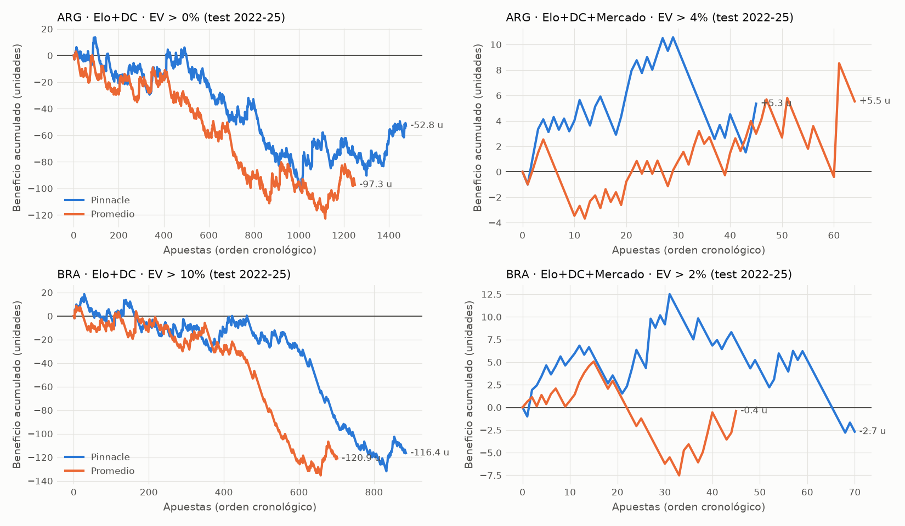
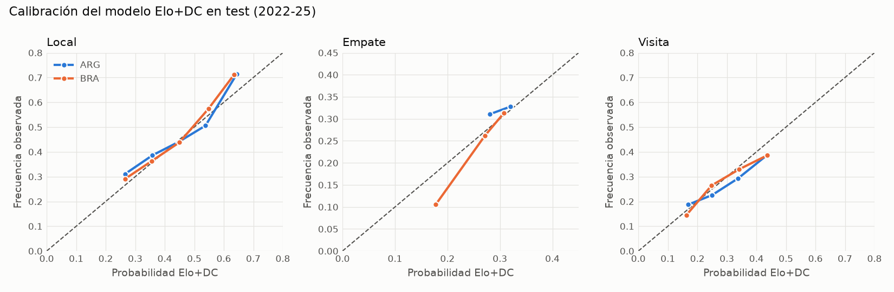

# Análisis 02 — Elo y Dixon-Coles contra el mercado (walk-forward)

*Generado por `scripts/evaluate_models.py`.*

**Diseño (sin leakage):** predicción semanal; cada semana el modelo se ajusta solo con partidos anteriores.
Validación 2016-2021: se eligen hiperparámetros, pesos y umbral de EV.
Test 2022-2025: evaluación única. Live 2026: sin Pinnacle.
Umbrales probados: [0.0, 0.02, 0.04, 0.06, 0.08, 0.1, 0.15]. El umbral se elige por yield en validación con al menos 100 apuestas.

**Mercado** = cuotas de cierre de Pinnacle sin margen (proporcional). Apostar a cuota de cierre es el
escenario más exigente: el precio ya incorpora toda la información previa al partido.
"Máxima" es la mejor cuota entre casas: cota superior **no alcanzable** en la práctica.

## ARG

**Hiperparámetros elegidos en validación:** Dixon-Coles `{'xi': 0.002, 'alpha': 0.01}` · Elo `{'k': 8, 'home_adv': 10, 'new_team_offset': 25, 'season_regress': 0.1}`
**Pesos del ensamble** (log-lineal, ajustados en validación): Elo+DC = [0.6, 0.45] ·
Elo+DC+Mercado = [0.22, -0.4, 1.21] (último peso = mercado)

### Calidad probabilística (mismos partidos; val/test con Pinnacle, live contra el promedio)

| periodo   | modelo         |    n |   log_loss |    rps |   brier | accuracy   |   Δ log loss vs mercado |
|:----------|:---------------|-----:|-----------:|-------:|--------:|:-----------|------------------------:|
| val       | Naive          | 1990 |     1.0734 | 0.2227 |  0.6491 | 44.3%      |                  0.0518 |
| val       | Elo            | 1990 |     1.0437 | 0.2128 |  0.6288 | 46.5%      |                  0.022  |
| val       | Dixon-Coles    | 1990 |     1.045  | 0.2131 |  0.6296 | 46.5%      |                  0.0234 |
| val       | Mercado        | 1990 |     1.0216 | 0.2054 |  0.6135 | 48.4%      |                  0      |
| val       | Elo+DC         | 1990 |     1.0429 | 0.2126 |  0.6283 | 46.8%      |                  0.0213 |
| val       | Elo+DC+Mercado | 1990 |     1.0205 | 0.205  |  0.6127 | 48.8%      |                 -0.0011 |
| test      | Naive          | 1598 |     1.0736 | 0.2161 |  0.6497 | 43.4%      |                  0.0203 |
| test      | Elo            | 1598 |     1.0631 | 0.2128 |  0.6419 | 43.7%      |                  0.0097 |
| test      | Dixon-Coles    | 1598 |     1.0675 | 0.2138 |  0.6448 | 43.3%      |                  0.0141 |
| test      | Mercado        | 1598 |     1.0534 | 0.2098 |  0.6353 | 44.4%      |                  0      |
| test      | Elo+DC         | 1598 |     1.0646 | 0.2132 |  0.6429 | 43.2%      |                  0.0112 |
| test      | Elo+DC+Mercado | 1598 |     1.0534 | 0.2099 |  0.6354 | 44.3%      |                  0.0001 |
| live      | Naive          |  418 |     1.0787 | 0.2212 |  0.6529 | 42.8%      |                  0.0448 |
| live      | Elo            |  418 |     1.0542 | 0.2128 |  0.6356 | 44.7%      |                  0.0203 |
| live      | Dixon-Coles    |  418 |     1.0529 | 0.2127 |  0.6353 | 45.0%      |                  0.0191 |
| live      | Mercado        |  418 |     1.0339 | 0.2069 |  0.6218 | 43.5%      |                  0      |
| live      | Elo+DC         |  418 |     1.0523 | 0.2124 |  0.6345 | 43.3%      |                  0.0184 |
| live      | Elo+DC+Mercado |  418 |     1.0327 | 0.2065 |  0.6207 | 44.3%      |                 -0.0012 |

### Apuestas con el umbral elegido en validación

Flat = 1 unidad por apuesta. Kelly = ¼ Kelly con tope 5% del bankroll, banca inicial 100.

| estrategia     | periodo   | cuota              |   min_ev |   apuestas | acierto   |   cuota_media | yield   | yield_ic95       |   max_dd_u |   racha_perd | kelly_profit_%   | kelly_max_dd   | mix                               |
|:---------------|:----------|:-------------------|---------:|-----------:|:----------|--------------:|:--------|:-----------------|-----------:|-------------:|:-----------------|:---------------|:----------------------------------|
| Elo+DC         | test      | Pinnacle           |     0    |       1476 | 27.2%     |          4.06 | -3.6%   | [-13.0%, +5.6%]  |      114.7 |           14 | -77.9%           | 89.0%          | Local 717, Visita 702, Empate 57  |
| Elo+DC         | test      | Promedio           |     0    |       1249 | 27.5%     |          3.88 | -7.8%   | [-17.0%, +1.7%]  |      125.6 |           18 | -85.1%           | 89.2%          | Local 633, Visita 569, Empate 47  |
| Elo+DC         | test      | Máxima             |     0    |       1576 | 28.0%     |          4.12 | +1.1%   | [-8.0%, +10.8%]  |       82.5 |           16 | -65.0%           | 81.8%          | Local 757, Visita 722, Empate 97  |
| Elo+DC         | live      | Promedio           |     0    |        274 | 24.5%     |          4.19 | -16.9%  | [-35.4%, +3.1%]  |       52.5 |           23 | -20.4%           | 34.3%          |                                   |
| Elo+DC         | live      | Betfair (-5% com.) |     0    |        317 | 26.2%     |          4.35 | -5.1%   | [-24.4%, +15.6%] |       39.9 |           22 | +1.3%            | 37.1%          |                                   |
| Elo+DC+Mercado | test      | Pinnacle           |     0.04 |         45 | 46.7%     |          2.67 | +11.9%  | [-24.3%, +48.0%] |        9.1 |            8 | +6.8%            | 7.2%           | Visita 21, Local 19, Empate 5     |
| Elo+DC+Mercado | test      | Promedio           |     0.04 |         64 | 43.8%     |          2.49 | +8.6%   | [-27.5%, +48.0%] |        6.2 |            6 | +1.5%            | 7.5%           | Local 41, Visita 19, Empate 4     |
| Elo+DC+Mercado | test      | Máxima             |     0.04 |        736 | 42.4%     |          3.04 | +20.4%  | [+8.9%, +32.5%]  |       19   |           10 | +205.0%          | 24.2%          | Local 310, Visita 234, Empate 192 |
| Elo+DC+Mercado | live      | Promedio           |     0.04 |          1 | 100.0%    |          2.49 | +149.0% |                  |        0   |            0 | +7.5%            | 0.0%           |                                   |
| Elo+DC+Mercado | live      | Betfair (-5% com.) |     0.04 |         39 | 20.5%     |          5.79 | -32.1%  | [-73.0%, +16.0%] |       16.4 |            8 | +6.6%            | 4.2%           |                                   |

Todos los umbrales en test a cuota Pinnacle (solo transparencia: NO elegir mirando esto)

| estrategia     |   min_ev |   apuestas | yield   | yield_ic95       |
|:---------------|---------:|-----------:|:--------|:-----------------|
| Elo+DC         |     0    |       1476 | -3.6%   | [-13.0%, +5.6%]  |
| Elo+DC         |     0.02 |       1346 | -2.3%   | [-12.0%, +8.0%]  |
| Elo+DC         |     0.04 |       1223 | +0.4%   | [-9.6%, +11.6%]  |
| Elo+DC         |     0.06 |       1104 | +0.3%   | [-10.5%, +12.5%] |
| Elo+DC         |     0.08 |       1001 | +0.8%   | [-10.9%, +13.5%] |
| Elo+DC         |     0.1  |        903 | +2.3%   | [-11.0%, +15.6%] |
| Elo+DC         |     0.15 |        695 | +1.9%   | [-14.1%, +18.4%] |
| Elo+DC+Mercado |     0    |        627 | -4.8%   | [-13.8%, +4.9%]  |
| Elo+DC+Mercado |     0.02 |        199 | +5.5%   | [-11.2%, +22.8%] |
| Elo+DC+Mercado |     0.04 |         45 | +11.9%  | [-24.3%, +48.0%] |
| Elo+DC+Mercado |     0.06 |          6 | -9.8%   |                  |
| Elo+DC+Mercado |     0.08 |          1 | -100.0% |                  |

## BRA

**Hiperparámetros elegidos en validación:** Dixon-Coles `{'xi': 0.002, 'alpha': 0.01}` · Elo `{'k': 20, 'home_adv': 110, 'new_team_offset': 100, 'season_regress': 0.1}`
**Pesos del ensamble** (log-lineal, ajustados en validación): Elo+DC = [0.64, 0.35] ·
Elo+DC+Mercado = [0.24, -0.25, 1.05] (último peso = mercado)

### Calidad probabilística (mismos partidos; val/test con Pinnacle, live contra el promedio)

| periodo   | modelo         |    n |   log_loss |    rps |   brier | accuracy   |   Δ log loss vs mercado |
|:----------|:---------------|-----:|-----------:|-------:|--------:|:-----------|------------------------:|
| val       | Naive          | 2279 |     1.0509 | 0.2169 |  0.6332 | 48.3%      |                  0.0547 |
| val       | Elo            | 2279 |     1.0175 | 0.2057 |  0.6104 | 50.6%      |                  0.0212 |
| val       | Dixon-Coles    | 2279 |     1.0193 | 0.2064 |  0.6115 | 50.0%      |                  0.0231 |
| val       | Mercado        | 2279 |     0.9962 | 0.1992 |  0.596  | 52.0%      |                  0      |
| val       | Elo+DC         | 2279 |     1.0165 | 0.2055 |  0.6097 | 50.2%      |                  0.0203 |
| val       | Elo+DC+Mercado | 2279 |     0.9956 | 0.199  |  0.5956 | 51.8%      |                 -0.0006 |
| test      | Naive          | 1476 |     1.0585 | 0.2215 |  0.6384 | 47.2%      |                  0.0602 |
| test      | Elo            | 1476 |     1.023  | 0.2094 |  0.6129 | 48.9%      |                  0.0247 |
| test      | Dixon-Coles    | 1476 |     1.0224 | 0.2093 |  0.6123 | 49.1%      |                  0.0241 |
| test      | Mercado        | 1476 |     0.9983 | 0.2018 |  0.5967 | 50.9%      |                  0      |
| test      | Elo+DC         | 1476 |     1.0215 | 0.209  |  0.6118 | 48.8%      |                  0.0232 |
| test      | Elo+DC+Mercado | 1476 |     0.9989 | 0.2019 |  0.5971 | 50.8%      |                  0.0006 |
| live      | Naive          |  279 |     1.0592 | 0.2196 |  0.6391 | 47.0%      |                  0.0563 |
| live      | Elo            |  279 |     1.0194 | 0.2058 |  0.6133 | 50.5%      |                  0.0165 |
| live      | Dixon-Coles    |  279 |     1.0274 | 0.2076 |  0.6183 | 50.2%      |                  0.0245 |
| live      | Mercado        |  279 |     1.0029 | 0.2006 |  0.6011 | 50.9%      |                  0      |
| live      | Elo+DC         |  279 |     1.0205 | 0.2059 |  0.6138 | 50.2%      |                  0.0176 |
| live      | Elo+DC+Mercado |  279 |     1.0018 | 0.2005 |  0.6007 | 50.5%      |                 -0.0011 |

### Apuestas con el umbral elegido en validación

Flat = 1 unidad por apuesta. Kelly = ¼ Kelly con tope 5% del bankroll, banca inicial 100.

| estrategia     | periodo   | cuota              |   min_ev |   apuestas | acierto   |   cuota_media | yield   | yield_ic95       |   max_dd_u |   racha_perd | kelly_profit_%   | kelly_max_dd   | mix                               |
|:---------------|:----------|:-------------------|---------:|-----------:|:----------|--------------:|:--------|:-----------------|-----------:|-------------:|:-----------------|:---------------|:----------------------------------|
| Elo+DC         | test      | Pinnacle           |     0.1  |        885 | 21.9%     |          4.99 | -13.2%  | [-24.6%, -1.5%]  |      150.4 |           29 | -96.6%           | 98.7%          | Visita 547, Local 330, Empate 8   |
| Elo+DC         | test      | Promedio           |     0.1  |        702 | 21.7%     |          4.8  | -17.2%  | [-30.6%, -3.6%]  |      144.1 |           26 | -95.4%           | 98.1%          | Visita 423, Local 277, Empate 2   |
| Elo+DC         | test      | Máxima             |     0.1  |       1038 | 22.4%     |          5.04 | -8.2%   | [-20.5%, +4.3%]  |      135.2 |           35 | -96.1%           | 98.6%          | Visita 638, Local 387, Empate 13  |
| Elo+DC         | live      | Promedio           |     0.1  |        123 | 26.8%     |          4.4  | -10.2%  | [-38.8%, +20.4%] |       25.3 |           13 | -39.7%           | 48.4%          |                                   |
| Elo+DC         | live      | Betfair (-5% com.) |     0.1  |        158 | 24.7%     |          4.93 | -9.7%   | [-35.7%, +21.1%] |       30.8 |           13 | -45.1%           | 55.2%          |                                   |
| Elo+DC+Mercado | test      | Pinnacle           |     0.02 |         70 | 38.6%     |          2.7  | -3.8%   | [-33.9%, +29.1%] |       15.3 |            9 | -5.0%            | 9.0%           | Local 40, Empate 19, Visita 11    |
| Elo+DC+Mercado | test      | Promedio           |     0.02 |         45 | 46.7%     |          2.46 | -0.9%   | [-34.1%, +32.6%] |       12.6 |            5 | +0.9%            | 10.4%          | Local 34, Visita 6, Empate 5      |
| Elo+DC+Mercado | test      | Máxima             |     0.02 |        897 | 37.3%     |          3.04 | -1.0%   | [-10.9%, +9.1%]  |       49.3 |           14 | -15.4%           | 36.3%          | Local 425, Empate 338, Visita 134 |
| Elo+DC+Mercado | live      | Promedio           |     0.02 |          3 | 0.0%      |          2.63 | -100.0% |                  |        3   |            3 | -1.6%            | 1.6%           |                                   |
| Elo+DC+Mercado | live      | Betfair (-5% com.) |     0.02 |         32 | 12.5%     |          7.5  | -22.8%  | [-94.2%, +70.5%] |       18   |           18 | -7.8%            | 8.9%           |                                   |

Todos los umbrales en test a cuota Pinnacle (solo transparencia: NO elegir mirando esto)

| estrategia     |   min_ev |   apuestas | yield   | yield_ic95       |
|:---------------|---------:|-----------:|:--------|:-----------------|
| Elo+DC         |     0    |       1379 | -13.1%  | [-22.0%, -4.0%]  |
| Elo+DC         |     0.02 |       1263 | -12.5%  | [-22.3%, -2.8%]  |
| Elo+DC         |     0.04 |       1154 | -14.5%  | [-24.9%, -4.5%]  |
| Elo+DC         |     0.06 |       1056 | -13.8%  | [-24.3%, -2.7%]  |
| Elo+DC         |     0.08 |        963 | -13.4%  | [-24.1%, -2.1%]  |
| Elo+DC         |     0.1  |        885 | -13.2%  | [-24.6%, -1.5%]  |
| Elo+DC         |     0.15 |        702 | -12.3%  | [-25.9%, +1.2%]  |
| Elo+DC+Mercado |     0    |        382 | -7.8%   | [-20.2%, +4.4%]  |
| Elo+DC+Mercado |     0.02 |         70 | -3.8%   | [-33.9%, +29.1%] |
| Elo+DC+Mercado |     0.04 |          9 | -47.4%  |                  |

