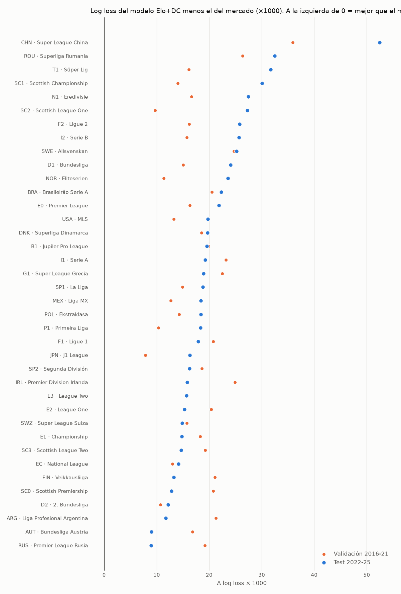

# Análisis 03 — Comparación de 38 ligas: ¿dónde supera el modelo al mercado?

*Generado por `scripts/screen_leagues.py`. Criterio pre-registrado en [decisiones.md](../decisiones.md).*

Mismo pipeline que el análisis 02 con grillas reducidas: Elo entrenado con todas las divisiones del país
(los ascendidos llegan con historial), Dixon-Coles con la liga evaluada. Validación 2016-21, test 2022-25,
mercado = cierre de Pinnacle sin margen.

**Resumen:** el modelo solo (Elo+DC) supera al mercado en test en **0 de 38** ligas.
El ensamble con el mercado mejora al mercado en test en **19 de 38**.
Ligas que cumplen el criterio pre-registrado: **SWE, I1, P1, T1**.

## Calidad probabilística (Δ = log loss − log loss del mercado, × 1000; negativo = mejor que el mercado)

Ordenado de la liga más predecible a la menos predecible para el mercado.

| Liga                             |   Partidos test | Margen Pinnacle   | Margen promedio   |   LL mercado test |   Δ modelo val |   Δ modelo test |   Δ ensamble val |   Δ ensamble test |
|:---------------------------------|----------------:|:------------------|:------------------|------------------:|---------------:|----------------:|-----------------:|------------------:|
| CHN · Super League China         |            1016 | 4.9%              | 7.6%              |            0.888  |           35.9 |            52.5 |             -1.3 |              -2.8 |
| P1 · Primeira Liga               |            1225 | 3.3%              | 5.8%              |            0.9029 |           10.3 |            18.4 |             -2.6 |              -2.6 |
| N1 · Eredivisie                  |            1196 | 3.3%              | 5.5%              |            0.9201 |           16.6 |            27.5 |             -1.2 |               0.4 |
| SC0 · Scottish Premiership       |             847 | 3.3%              | 6.0%              |            0.9337 |           20.7 |            12.8 |             -0.8 |              -0.3 |
| G1 · Super League Grecia         |             906 | 4.7%              | 7.1%              |            0.9394 |           22.5 |            18.9 |             -2.4 |               1.9 |
| E0 · Premier League              |            1523 | 2.8%              | 4.2%              |            0.9454 |           16.3 |            21.8 |             -0.7 |              -0.5 |
| T1 · Süper Lig                   |            1359 | 3.3%              | 6.3%              |            0.9473 |           16.1 |            31.7 |             -1.2 |              -5   |
| SP1 · La Liga                    |            1508 | 2.7%              | 4.6%              |            0.9576 |           14.9 |            18.8 |             -1.4 |              -0   |
| B1 · Jupiler Pro League          |            1145 | 3.7%              | 6.2%              |            0.9689 |           19.9 |            19.5 |             -1.4 |              -0.1 |
| NOR · Eliteserien                |             932 | 3.3%              | 6.5%              |            0.9707 |           11.3 |            23.6 |             -1   |               2   |
| D1 · Bundesliga                  |            1206 | 2.8%              | 4.5%              |            0.9734 |           15.1 |            24.1 |             -0.6 |              -1   |
| F1 · Ligue 1                     |            1328 | 2.7%              | 4.8%              |            0.9735 |           20.7 |            17.9 |             -0.5 |              -0.8 |
| I1 · Serie A                     |            1497 | 2.7%              | 4.7%              |            0.9745 |           23.2 |            19.2 |             -3   |              -0.2 |
| RUS · Premier League Rusia       |             932 | 3.6%              | 5.4%              |            0.9747 |           19.2 |             8.9 |             -0.4 |               1.1 |
| SWE · Allsvenskan                |             948 | 3.4%              | 6.3%              |            0.9861 |           24.7 |            25.2 |             -2.5 |              -0.7 |
| FIN · Veikkausliiga              |             674 | 3.3%              | 7.4%              |            0.9871 |           21.1 |            13.2 |             -0.7 |              -4.1 |
| SC2 · Scottish League One        |             679 | 6.2%              | 9.0%              |            0.9877 |            9.7 |            27.2 |             -1   |               1.1 |
| IRL · Premier Division Irlanda   |             716 | 3.7%              | 7.6%              |            0.9931 |           24.9 |            15.8 |             -0.6 |               1   |
| MEX · Liga MX                    |            1324 | 3.2%              | 7.1%              |            0.9942 |           12.7 |            18.4 |             -0.5 |              -0.4 |
| BRA · Brasileirão Serie A        |            1476 | 3.4%              | 6.0%              |            0.9983 |           20.5 |            22.3 |             -0.4 |               0.1 |
| AUT · Bundesliga Austria         |             734 | 3.3%              | 6.6%              |            0.9986 |           16.8 |             9   |             -1   |               2.5 |
| ROU · Superliga Rumania          |            1217 | 4.9%              | 8.1%              |            0.999  |           26.3 |            32.5 |             -0.4 |              -0.7 |
| DNK · Superliga Dinamarca        |             747 | 3.5%              | 6.4%              |            1.0094 |           18.5 |            19.7 |             -1.5 |              -1.4 |
| E2 · League One                  |            2100 | 3.7%              | 6.6%              |            1.0105 |           20.4 |            15.3 |             -2   |               1.2 |
| EC · National League             |            2123 | 4.9%              | 8.5%              |            1.0151 |           13   |            14.2 |             -0   |              -0.1 |
| POL · Ekstraklasa                |            1166 | 3.7%              | 7.2%              |            1.0256 |           14.3 |            18.4 |             -0.1 |               0.4 |
| USA · MLS                        |            2057 | 3.2%              | 6.0%              |            1.0269 |           13.2 |            19.8 |             -1.1 |               1.7 |
| SWZ · Super League Suiza         |             789 | 3.7%              | 7.0%              |            1.0295 |           15.8 |            14.8 |             -1.4 |               0.6 |
| D2 · 2. Bundesliga               |            1152 | 3.2%              | 6.2%              |            1.0324 |           10.7 |            12.2 |             -0.7 |               0.8 |
| E1 · Championship                |            2177 | 3.1%              | 5.3%              |            1.0327 |           18.3 |            14.8 |             -0.6 |               0.7 |
| F2 · Ligue 2                     |            1354 | 3.7%              | 6.9%              |            1.0344 |           16.2 |            25.8 |             -0.3 |              -0.7 |
| SC1 · Scottish Championship      |             687 | 4.9%              | 8.2%              |            1.0349 |           14   |            30.1 |             -2.2 |              -0.7 |
| SP2 · Segunda División           |            1791 | 3.3%              | 6.9%              |            1.0359 |           18.6 |            16.2 |             -0.9 |              -0   |
| E3 · League Two                  |            2117 | 4.0%              | 6.8%              |            1.0451 |           15.6 |            15.7 |             -0.9 |               0.8 |
| JPN · J1 League                  |            1364 | 3.2%              | 6.5%              |            1.049  |            7.9 |            16.3 |             -1.2 |               0.9 |
| I2 · Serie B                     |            1432 | 3.1%              | 6.8%              |            1.0498 |           15.7 |            25.7 |             -0.5 |               0.6 |
| ARG · Liga Profesional Argentina |            1598 | 3.6%              | 6.3%              |            1.0534 |           21.3 |            11.7 |             -1   |               0.5 |
| SC3 · Scottish League Two        |             681 | 6.3%              | 9.1%              |            1.0641 |           19.2 |            14.6 |             -1.4 |               3.1 |

## Apuestas con el ensamble Elo+DC+Mercado (umbral elegido en validación)

"IC Bonferroni" corrige por las 38 ligas comparadas (nivel 99.87%).

| Liga   | Umbral EV   | Yield val   |   Apuestas val | Yield test Pinnacle   |   Apuestas test | IC95%             | IC Bonferroni     | Yield test promedio   | Yield test modelo solo (Pinnacle)   | Criterio                  |
|:-------|:------------|:------------|---------------:|:----------------------|----------------:|:------------------|:------------------|:----------------------|:------------------------------------|:--------------------------|
| ARG    | 4%          | +14.3%      |            100 | -4.0%                 |              27 | [-46.0%, +40.7%]  | [-69.3%, +71.8%]  | +6.3%                 | -4.0%                               | no                        |
| BRA    | 0%          | -7.0%       |            472 | -9.5%                 |             181 | [-25.3%, +6.6%]   | [-33.6%, +17.8%]  | +3.1%                 | -13.8%                              | no                        |
| AUT    | 4%          | +27.0%      |            265 | -36.5%                |             181 | [-60.4%, -9.5%]   | [-70.8%, +9.5%]   | -36.4%                | -8.9%                               | candidata (falla en test) |
| CHN    | 2%          | +4.3%       |            104 | -0.5%                 |              37 | [-31.2%, +30.1%]  | [-47.9%, +47.3%]  | +11.4%                | -22.5%                              | candidata (falla en test) |
| DNK    | 0%          | +3.8%       |            860 | -0.5%                 |             398 | [-11.1%, +10.0%]  | [-17.4%, +17.6%]  | +5.4%                 | -16.0%                              | candidata (falla en test) |
| FIN    | 2%          | +17.4%      |            183 | +27.4%                |             100 | [+4.2%, +52.5%]   | [-12.5%, +69.1%]  | +45.8%                | -4.5%                               | no                        |
| IRL    | 0%          | -1.7%       |            287 | -11.6%                |              54 | [-34.4%, +10.2%]  | [-46.0%, +27.8%]  | -32.6%                | -4.3%                               | no                        |
| JPN    | 2%          | +10.5%      |            763 | -0.4%                 |             508 | [-12.4%, +11.6%]  | [-19.1%, +21.7%]  | -9.4%                 | -3.4%                               | candidata (falla en test) |
| MEX    | 2%          | -0.6%       |            203 | -5.1%                 |              63 | [-40.7%, +31.7%]  | [-58.6%, +56.1%]  | -36.1%                | -11.0%                              | no                        |
| NOR    | 6%          | +30.2%      |            100 | -9.6%                 |             216 | [-33.0%, +14.8%]  | [-45.2%, +32.1%]  | -3.7%                 | -4.4%                               | candidata (falla en test) |
| POL    | 15%         |             |              0 |                       |               0 |                   |                   |                       | -10.2%                              | no                        |
| ROU    | 0%          | +2.7%       |            290 | +40.3%                |              27 | [-10.0%, +88.6%]  | [-36.3%, +115.5%] | +30.5%                | -13.8%                              | no                        |
| RUS    | 2%          | +14.2%      |            137 | -17.7%                |              76 | [-47.6%, +13.1%]  | [-63.6%, +36.3%]  | -32.3%                | -7.0%                               | no                        |
| SWE    | 6%          | +9.9%       |            205 | +9.8%                 |              56 | [-24.5%, +46.4%]  | [-39.7%, +65.6%]  | +28.5%                | -8.0%                               | CONFIRMADA                |
| SWZ    | 4%          | +10.3%      |            187 | -6.0%                 |             338 | [-22.7%, +12.2%]  | [-32.1%, +24.7%]  | +14.1%                | -3.2%                               | candidata (falla en test) |
| USA    | 6%          | +24.4%      |            111 | +29.1%                |              18 | [-49.8%, +115.4%] | [-87.9%, +174.0%] | -76.5%                | -20.6%                              | candidata (falla en test) |
| E0     | 4%          | +11.3%      |            118 | -4.1%                 |             129 | [-29.7%, +21.9%]  | [-46.9%, +36.3%]  | -7.2%                 | -5.6%                               | no                        |
| E1     | 2%          | +12.2%      |            381 | +5.2%                 |             148 | [-11.0%, +20.8%]  | [-20.1%, +33.1%]  | +13.3%                | -1.5%                               | no                        |
| E2     | 8%          | +17.0%      |            132 | +0.4%                 |              84 | [-21.0%, +22.5%]  | [-33.4%, +34.0%]  | +16.6%                | -1.3%                               | candidata (falla en test) |
| E3     | 4%          | +12.5%      |            259 | -6.4%                 |              99 | [-28.1%, +17.6%]  | [-43.8%, +33.5%]  | +11.9%                | -2.7%                               | no                        |
| EC     | 15%         |             |              0 |                       |               0 |                   |                   | -100.0%               | -8.9%                               | no                        |
| SC0    | 4%          | +9.3%       |            132 | -47.4%                |              28 | [-88.4%, +4.3%]   | [-100.0%, +42.6%] | -56.0%                | +0.9%                               | no                        |
| SC1    | 10%         | +19.8%      |            159 | -19.8%                |              48 | [-81.2%, +53.2%]  | [-100.0%, +99.2%] | -100.0%               | -14.6%                              | candidata (falla en test) |
| SC2    | 0%          | -2.7%       |            466 | -12.1%                |             233 | [-34.2%, +11.7%]  | [-46.4%, +26.2%]  | -12.2%                | -15.8%                              | no                        |
| SC3    | 0%          | -0.0%       |            458 | -20.0%                |              62 | [-42.4%, +3.4%]   | [-52.9%, +18.6%]  | -21.1%                | -3.0%                               | no                        |
| D1     | 8%          | +2.0%       |            165 | -10.3%                |             126 | [-58.5%, +57.2%]  | [-79.6%, +107.7%] | +28.8%                | -13.0%                              | no                        |
| D2     | 0%          | +3.1%       |           1148 | -10.3%                |             810 | [-21.5%, +1.6%]   | [-27.2%, +9.1%]   | -0.7%                 | -4.8%                               | no                        |
| I1     | 8%          | +24.5%      |            147 | +12.8%                |              79 | [-18.9%, +45.1%]  | [-33.9%, +69.1%]  | +33.6%                | -12.3%                              | CONFIRMADA                |
| I2     | 0%          | -4.8%       |            840 | -10.0%                |             573 | [-19.6%, -0.2%]   | [-25.4%, +5.2%]   | +3.2%                 | -12.9%                              | no                        |
| SP1    | 2%          | +4.8%       |           1124 | -4.3%                 |             793 | [-14.1%, +5.8%]   | [-21.0%, +12.5%]  | -4.4%                 | -10.9%                              | candidata (falla en test) |
| SP2    | 0%          | +2.5%       |           1407 | -1.0%                 |             957 | [-7.8%, +5.8%]    | [-12.1%, +9.7%]   | -2.8%                 | -8.6%                               | no                        |
| F1     | 0%          | +1.9%       |            906 | +5.9%                 |             443 | [-4.2%, +16.2%]   | [-10.6%, +23.1%]  | +1.3%                 | -16.2%                              | no                        |
| F2     | 0%          | +1.1%       |            381 | +3.1%                 |             173 | [-12.2%, +18.4%]  | [-21.8%, +27.0%]  | +22.8%                | -8.9%                               | no                        |
| N1     | 6%          | +6.8%       |            133 | -19.8%                |              80 | [-46.1%, +8.9%]   | [-61.9%, +24.4%]  | -31.4%                | -15.2%                              | candidata (falla en test) |
| B1     | 8%          | +10.4%      |            113 | -1.9%                 |             101 | [-34.9%, +32.9%]  | [-52.2%, +59.9%]  | -21.8%                | -11.0%                              | candidata (falla en test) |
| P1     | 4%          | +2.8%       |            320 | +6.7%                 |              94 | [-12.2%, +24.8%]  | [-23.7%, +36.8%]  | +1.5%                 | -19.8%                              | CONFIRMADA                |
| T1     | 0%          | +0.8%       |           1191 | +6.6%                 |             852 | [+0.4%, +12.8%]   | [-2.8%, +16.7%]   | +7.5%                 | -17.0%                              | CONFIRMADA                |
| G1     | 4%          | -0.5%       |            133 | -65.5%                |               4 |                   |                   | -7.5%                 | -4.7%                               | no                        |
