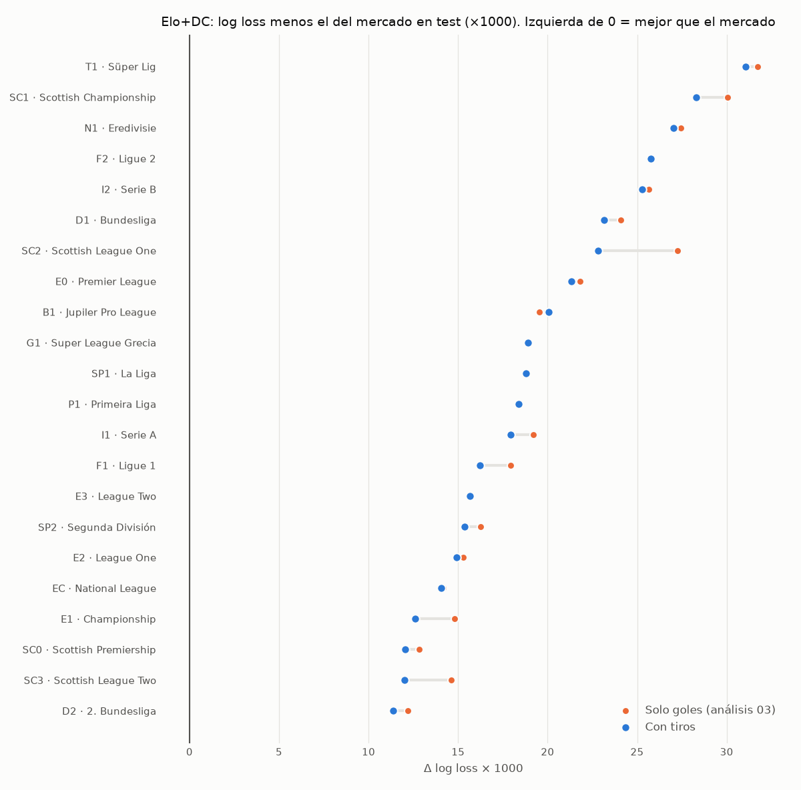

# Análisis 04 — Dixon-Coles con tiros

*Generado por `scripts/evaluate_shots.py`.*

El objetivo del modelo pasa de "goles" a `mix × goles + (1 − mix) × goles esperados por tiros`,
con los coeficientes de tiros al arco / fuera estimados en cada ventana de entrenamiento (sin leakage).
`mix` se elige en validación 2016-21 entre [1.0, 0.75, 0.5, 0.25]; el resto de hiperparámetros es el del análisis 03.
Comparación en test 2022-25, **partido a partido** (Δ log loss × 1000; negativo = mejora).

**Resultado agregado (30033 partidos de test, 22 ligas):**

- Dixon-Coles con tiros vs solo goles: **-0.81 (IC95% [-1.37, -0.25])**
- Elo+DC con tiros vs sin tiros: **-0.75 (IC95% [-1.16, -0.31])**
- Ensamble con el mercado, con tiros vs sin tiros: **+0.09 (IC95% [-0.03, +0.21])**
- El modelo Elo+DC mejora en **17 de 22** ligas; supera al mercado en **0 de 22**.

| Liga                        |   mix elegido |   Partidos test | Δ DC (tiros − goles)   |   Δ Elo+DC vs mercado antes |   Δ Elo+DC vs mercado ahora |   Δ ensamble vs mercado antes |   Δ ensamble vs mercado ahora | Yield test antes   | Yield test ahora   |   Apuestas ahora |
|:----------------------------|--------------:|----------------:|:-----------------------|----------------------------:|----------------------------:|------------------------------:|------------------------------:|:-------------------|:-------------------|-----------------:|
| E0 · Premier League         |          0.75 |            1523 | -1.1 [-3.3, +1.1]      |                        21.8 |                        21.3 |                          -0.5 |                          -0.3 | -4.1%              | -5.5%              |              177 |
| E1 · Championship           |          0.75 |            2177 | -2.6 [-4.1, -1.0]      |                        14.8 |                        12.6 |                           0.7 |                           0.9 | +5.2%              | -2.9%              |              142 |
| E2 · League One             |          0.5  |            2100 | +1.3 [-2.3, +5.0]      |                        15.3 |                        14.9 |                           1.2 |                           1   | +0.4%              | +6.1%              |               70 |
| E3 · League Two             |          0.5  |            2117 | -0.9 [-3.6, +1.8]      |                        15.7 |                        15.7 |                           0.8 |                           0.8 | -6.4%              | +0.7%              |               63 |
| EC · National League        |          0.25 |            2123 | +0.0 [+0.0, +0.0]      |                        14.2 |                        14.1 |                          -0.1 |                          -0.1 |                    |                    |                0 |
| SC0 · Scottish Premiership  |          0.5  |             847 | -0.2 [-4.1, +3.7]      |                        12.8 |                        12.1 |                          -0.3 |                          -0.3 | -47.4%             | +1.3%              |              283 |
| SC1 · Scottish Championship |          0.5  |             687 | -4.5 [-10.6, +1.5]     |                        30.1 |                        28.3 |                          -0.7 |                          -0.4 | -19.8%             | -12.3%             |               87 |
| SC2 · Scottish League One   |          0.5  |             679 | -3.4 [-9.1, +2.5]      |                        27.2 |                        22.8 |                           1.1 |                           0.9 | -12.1%             | -15.5%             |              254 |
| SC3 · Scottish League Two   |          0.75 |             681 | -3.9 [-7.5, -0.3]      |                        14.6 |                        12   |                           3.1 |                           3   | -20.0%             | -20.2%             |               52 |
| D1 · Bundesliga             |          0.75 |            1206 | -1.8 [-4.1, +0.4]      |                        24.1 |                        23.1 |                          -1   |                          -1.1 | -10.3%             | -6.6%              |              121 |
| D2 · 2. Bundesliga          |          0.75 |            1152 | -0.7 [-2.5, +1.1]      |                        12.2 |                        11.4 |                           0.8 |                           0.9 | -10.3%             | -42.6%             |              142 |
| I1 · Serie A                |          0.75 |            1497 | -1.0 [-3.3, +1.2]      |                        19.2 |                        17.9 |                          -0.2 |                          -0.4 | +12.8%             | +18.4%             |               79 |
| I2 · Serie B                |          0.75 |            1432 | -1.4 [-3.5, +0.7]      |                        25.7 |                        25.3 |                           0.6 |                           0.5 | -10.0%             | -10.5%             |              568 |
| SP1 · La Liga               |          1    |            1508 | +0.0 [+0.0, +0.0]      |                        18.8 |                        18.8 |                          -0   |                          -0   | -4.3%              | -4.3%              |              793 |
| SP2 · Segunda División      |          0.75 |            1791 | -0.6 [-2.0, +0.8]      |                        16.2 |                        15.4 |                          -0   |                           0.2 | -1.0%              | +0.6%              |             1075 |
| F1 · Ligue 1                |          0.75 |            1328 | -0.2 [-2.4, +2.0]      |                        17.9 |                        16.2 |                          -0.8 |                          -0.6 | +5.9%              | +4.4%              |              468 |
| F2 · Ligue 2                |          1    |            1354 | +0.0 [+0.0, +0.0]      |                        25.8 |                        25.8 |                          -0.7 |                          -0.7 | +3.1%              | +3.1%              |              173 |
| N1 · Eredivisie             |          0.5  |            1196 | -3.4 [-8.5, +1.4]      |                        27.5 |                        27   |                           0.4 |                           1.4 | -19.8%             | -31.5%             |               66 |
| B1 · Jupiler Pro League     |          0.5  |            1145 | +2.7 [-1.8, +7.0]      |                        19.5 |                        20.1 |                          -0.1 |                           0.8 | -1.9%              | -7.2%              |              683 |
| P1 · Primeira Liga          |          1    |            1225 | +0.0 [+0.0, +0.0]      |                        18.4 |                        18.4 |                          -2.6 |                          -2.6 | +6.7%              | +6.7%              |               94 |
| T1 · Süper Lig              |          0.75 |            1359 | -0.6 [-2.4, +1.3]      |                        31.7 |                        31.1 |                          -5   |                          -4.9 | +6.6%              | +8.0%              |              819 |
| G1 · Super League Grecia    |          1    |             906 | +0.0 [+0.0, +0.0]      |                        18.9 |                        18.9 |                           1.9 |                           1.9 | -65.5%             | -65.5%             |                4 |
